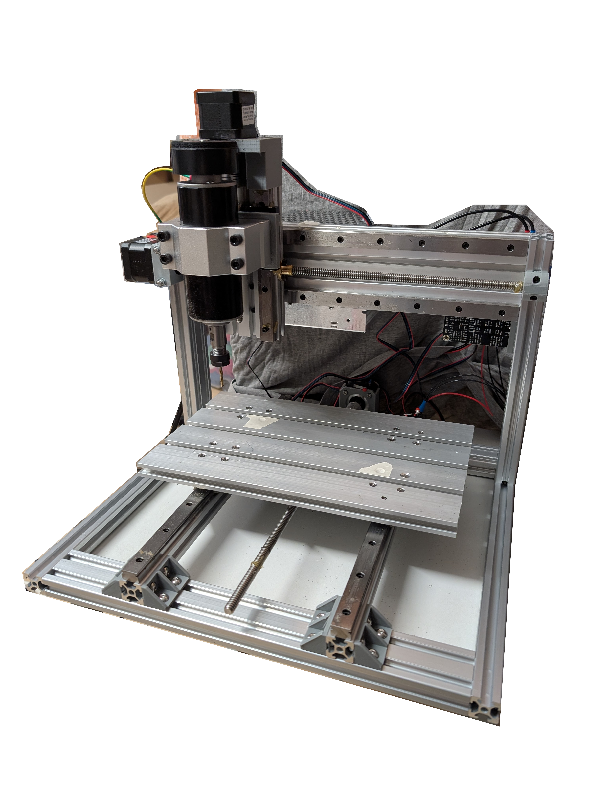
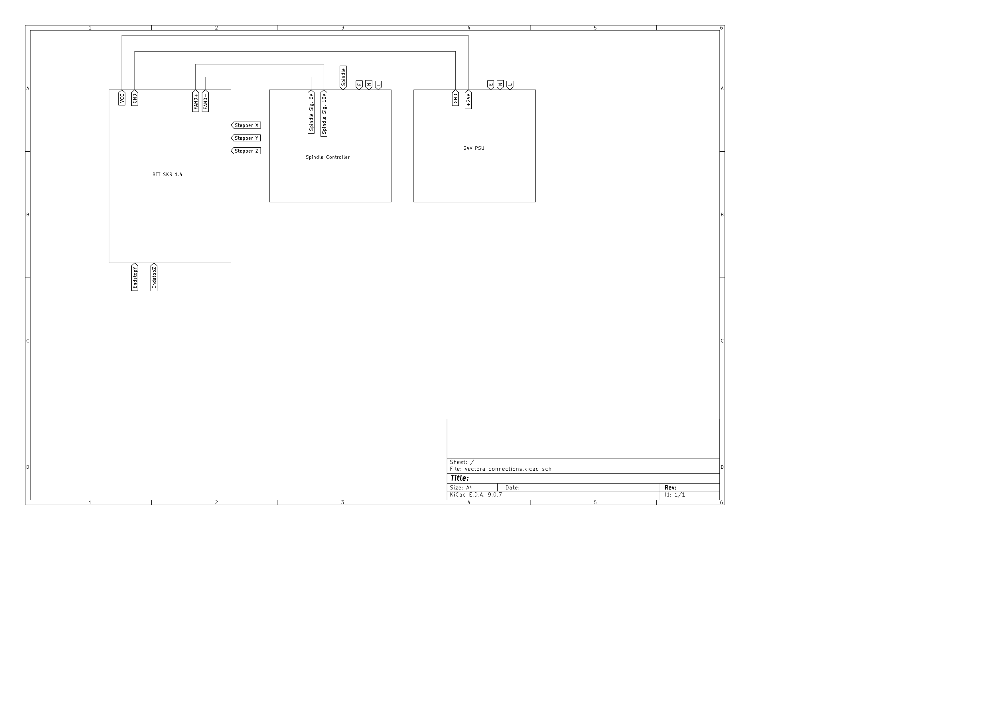

# VectoraCNC

VectoraCNC is a custom-designed desktop CNC machine. Built using mainly 2020 and 2040 aluminum extrusions, linear rails, and NEMA 17 stepper motors, this CNC aims to deliver reliable performance in a compact design while maintaining a budget build cost of approximately $400.
Simple Desktop CNC

This design aims to deliver a reliable CNC machine for makers, focused on affordability, while being a future-proof platform for upgrades and modifications.

## Why I Built This

I wanted a rigid desktop CNC to be able to machine some hard materials without spending $1000+. Most budget machines use wheels instead of linear rails, that's why VectoraCNC uses linear rails on all axes while keeping the total cost around $400.

## Images

CAD - click to expand

## Features

- 230 x 160 x 80 mm Work Area
- Rigid Frame with 2020 and 2040 Aluminum Extrusions
- Linear Rail Motion System for Precision
- NEMA 17 Stepper Motors with Microstepping Drivers
- 15180 Aluminum Plate

## BOM (Bill of Materials)

[ONLINE GOOGLE SHEETS](https://docs.google.com/spreadsheets/d/13GKgM2DIBkM6Ly_OZJB4GLy0vwwSqJ-mRrfgNgf3ems/edit?gid=1271841831#gid=1271841831)

## Design Specifications

- **Build Volume**: 230 x 160 x 80 mm
- **Bed Type**: 15180 300 mm T-Slot Aluminum Plate
- **Spindle**: 500W ER11 Collet Spindle
- **Stepper Motors**: NEMA 17 with TMC2209 Drivers
- **Motion System**: Linear rail guided on all axes
- **Control Board**: BIGTREETECH SKR V1.4
- **Firmware**: Marlin CNC Firmware

## Wiring Diagram

## License

This work is licensed under a
[Creative Commons Attribution-NonCommercial 4.0 International License][cc-by-nc].

[![CC BY-NC 4.0][cc-by-nc-image]][cc-by-nc]

[cc-by-nc]: https://creativecommons.org/licenses/by-nc/4.0/
[cc-by-nc-image]: https://licensebuttons.net/l/by-nc/4.0/88x31.png
[cc-by-nc-shield]: https://img.shields.io/badge/License-CC%20BY--NC%204.0-lightgrey.svg
